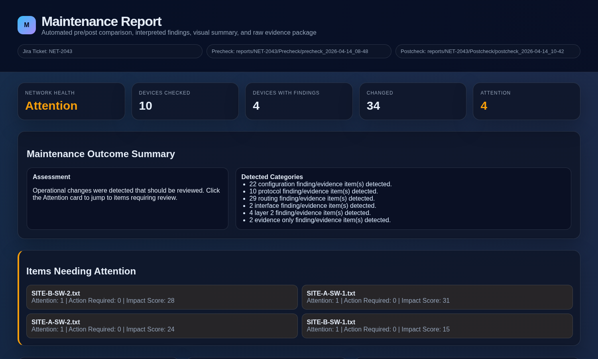
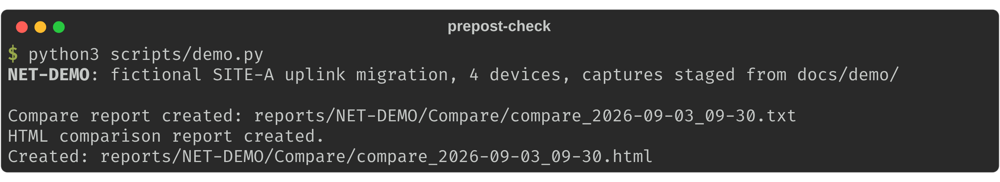
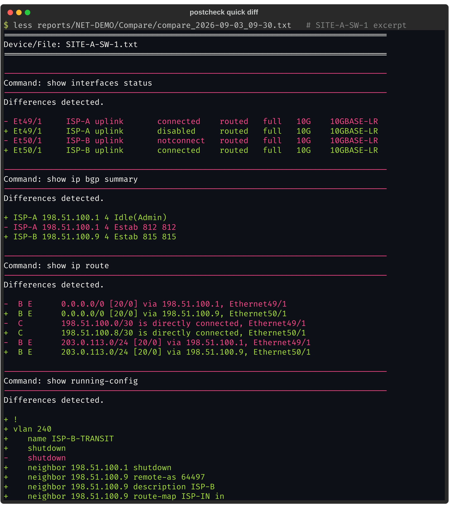
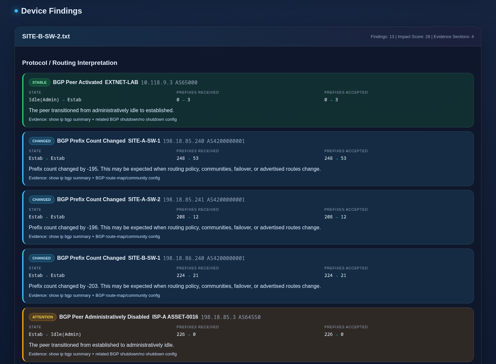
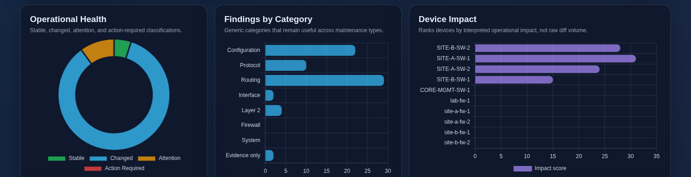

# prepost-check

[](https://github.com/fnitguy-tech/prepost-check/actions/workflows/ci.yml)

Pre/post change validation for network maintenance windows. Capture
device state before the change, capture it again after, and turn the
difference into evidence you can attach to the ticket: a quick text
diff for the on-call view and an interpreted HTML report for everyone
else.

Built for mixed Arista EOS + Palo Alto PAN-OS environments; any
platform netmiko can SSH to works by adding an inventory entry. Every
command it runs is a read-only `show`.



## What it tells you

A 10-device window, condensed from the full
[sample report](docs/sample-report.html) (download and open it in a
browser; GitHub does not render repo HTML):

```text
NET-2043   Network Health: ATTENTION    devices 10 · changed 34 · attention 4

SITE-B-SW-2    Attention 1 · Action Required 0 · Impact 28
  BGP Peer Activated        EXTNET-LAB  10.118.9.3  AS65000
    State                   Idle(Admin) → Estab
    Prefixes Received       0 → 3
    Evidence: show ip bgp summary + related BGP shutdown/no shutdown config

SITE-A-SW-1    Attention 1 · Action Required 0 · Impact 31
  BGP Prefix Count Changed  198.18.85.240  AS4200000001
    Prefixes Received       248 → 53
```

Every finding links to the raw before/after diff behind it. All hostnames,
addresses, and ASNs in the sample are fictional.

## Try it in 60 seconds, no devices

A fictional four-device uplink migration ships in `docs/demo/`
([scenario](docs/demo/NET-DEMO/SCENARIO.md)). One command runs the whole
compare pipeline on it:

```bash
git clone https://github.com/fnitguy-tech/prepost-check.git && cd prepost-check
python3 -m venv .venv && source .venv/bin/activate && pip install -r requirements.txt
python3 scripts/demo.py
```



Open `reports/NET-DEMO/Compare/compare_<timestamp>.html` for the
interpreted report. The quick text diff next to it is what the on-call
engineer reads before leaving the window:



Note what is *not* in that diff: uptime, BGP message counters, OSPF dead
timers, and optic readings all moved between the two captures, and the
normalizer dropped every one of them. SITE-B-SW-1, untouched by the change,
reports "No meaningful changes detected."

## Run it against your network

Python 3.10+ (netmiko 4.7 needs it) and SSH reachability to your devices. Three lines, then
answer the prompts (ticket number, SSH username, password):

```bash
git clone https://github.com/fnitguy-tech/prepost-check.git && cd prepost-check
python3 -m venv .venv && source .venv/bin/activate && pip install -r requirements.txt
cp inventory/devices.example.yml inventory/devices.yml && $EDITOR inventory/devices.yml && python3 scripts/precheck.py
```

`inventory/devices.yml` is gitignored, so real addresses stay on your
machine. Run `scripts/postcheck.py` after the change and
`scripts/compare.py` for the HTML report.

## Why this exists

"Did the maintenance break anything?" is usually answered by eyeballing
a handful of `show` commands from memory at 2 AM. This tool makes that
answer systematic:

- **Consistent evidence.** Every window captures the same commands from
  every device, timestamped and zipped per ticket. Nothing depends on
  what someone remembered to check.
- **Diffs that mean something.** Raw `show` output diffs are useless -
  uptimes, ARP timers, and BGP message counters change every second.
  Each command has a normalization rule that strips expected churn so
  the diff only shows operational change.
- **Interpretation, not just diffs.** BGP peers are parsed into
  per-peer state and correlated with config changes: a peer going
  `Estab → Idle(Admin)` right after a `neighbor x.x.x.x shutdown` line
  appeared in the config is reported as one finding with its evidence,
  rated `Attention`.

All device interaction is read-only `show` commands over SSH. The one
exception, PAN-OS `set cli config-output-format set`, only changes how
the config is *displayed* for the capture session (set-format diffs
line-by-line; the default XML tree does not) - it modifies nothing on
the device.

## Workflow

```
before the window   python3 scripts/precheck.py     -> reports/<TICKET>/Precheck/
      (do the change)
after the window    python3 scripts/postcheck.py    -> reports/<TICKET>/Postcheck/ + quick .txt diff
anytime after       python3 scripts/compare.py      -> reports/<TICKET>/Compare/compare_<ts>.html
```

Each script prompts for the ticket number and SSH credentials (or takes
`--ticket` / `--username`; the password is always prompted, never a
flag). Devices are collected in parallel with a live progress bar; an
unreachable device is recorded as a `<host>_FAILED.txt` finding instead
of aborting the run.

The HTML report is a single self-contained file: overall health verdict
(`Stable / Changed / Attention / Action Required`), per-device impact
scores, findings with before/after state, category and impact charts,
and every raw diff behind a collapsible section for evidence.





**See it for yourself:** [`docs/sample-report.html`](docs/sample-report.html)
is a complete sample report for a 10-device maintenance window (download
the raw file and open it in a browser - GitHub doesn't render repo HTML).
All hostnames, addresses, ASNs, and identifiers in it are fictional, and
the bulk routing-table evidence is truncated for size.

## Configuring the inventory

`inventory/devices.yml` groups devices by platform. Each platform
carries its netmiko `device_type` and the command list captured for it,
so adding a device, a command, or a whole new platform never means
editing Python:

```yaml
platforms:
  - name: arista
    device_type: arista_eos        # any netmiko driver name works
    hosts:
      - 192.0.2.11
    commands:
      - show ip bgp summary
      - show running-config
```

See `inventory/devices.example.yml` for the full curated command lists
for Arista EOS and PAN-OS.

Commands with per-second churn (e.g. `show interfaces transceiver`) are
still captured as evidence but excluded from comparison - the skip
lists and per-command normalization rules live in
`modules/textcompare.py` and `modules/htmlreport.py`, each rule
commented with what it strips and why.

## Repo layout

```
scripts/            entry points: precheck.py, postcheck.py, compare.py, demo.py
modules/
  inventory.py      loads + validates inventory/devices.yml
  collect.py        parallel SSH capture (netmiko), zip packaging
  textcompare.py    normalization rules + quick .txt diff report
  htmlreport.py     BGP interpretation, impact scoring, HTML dashboard
  layout.py         reports/<TICKET>/ directory conventions
  cli.py            shared argument handling
inventory/          devices.example.yml (copy to devices.yml, gitignored)
reports/            generated evidence, gitignored
tests/              pytest suite (no device access needed)
docs/               ARCHITECTURE.md (design decisions), sample report + screenshots,
                    demo/NET-DEMO (fictional captures used by scripts/demo.py)
.github/workflows/  ci.yml: ruff + yamllint + pytest on every push
```

## Tests and lint

```bash
python3 -m pytest tests/    # 22 tests, all offline - synthetic capture files
ruff check .
yamllint .                  # .yamllint config is checked in
```

The test suite covers the normalization rules, BGP summary parsing,
finding classification, and both report generators end-to-end against
synthetic device captures, so parser changes can be validated without
touching a live network.

## License

MIT - see [LICENSE](LICENSE).
