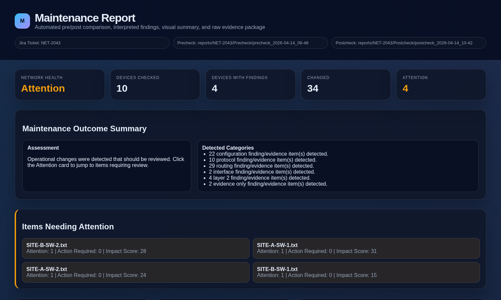
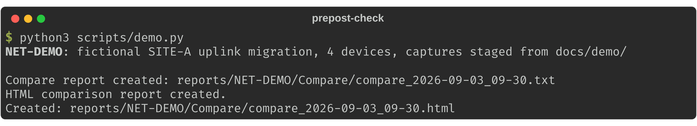

# prepost-check

[](https://github.com/fnitguy-tech/prepost-check/actions/workflows/ci.yml)

**Prove your maintenance window didn't break anything.** Capture your
devices before the change, capture them again after, and get told what
actually changed - a quick text diff for the on-call view, and an
interpreted HTML report you can attach to the ticket.

It's built for mixed Arista EOS and Palo Alto PAN-OS. Any platform
netmiko can SSH to works too; just add an inventory entry. Every command
it runs is a read-only `show`.



## What it tells you

A 10-device window, condensed from the full
[sample report](docs/sample-report.html) (download and open it in a
browser; GitHub does not render repo HTML):

```text
NET-2043   Network Health: ATTENTION    devices 10 · changed 34 · attention 4

SITE-B-SW-2    Attention 1 · Action Required 0 · Impact 28
  BGP Peer Activated        EXTNET-LAB  10.118.9.3  AS65000
    State                   Idle(Admin) → Estab
    Prefixes Received       0 → 3
    Evidence: show ip bgp summary + related BGP shutdown/no shutdown config

SITE-A-SW-1    Changed 1 · Attention 0 · Impact 2
  BGP Prefix Count Changed  198.18.85.240  AS4200000001
    Prefixes Received       248 → 53
    Prefix count changed by -195. That's normal if this window touched
    routing policy, communities, failover, or advertised routes.

SITE-C-SW-2    Attention 1 · Action Required 0 · Impact 5
  Prefix-List Entry Removed  ISP-OUT  seq 40
    Entry                   permit 198.51.100.243/32 → Not Present
    Evidence: show ip prefix-list
```

Every finding links to the raw before/after diff behind it. All hostnames,
addresses, and ASNs in the sample are fictional.

## Try it in 60 seconds, no devices

A fictional four-device uplink migration ships in `docs/demo/`
([scenario](docs/demo/NET-DEMO/SCENARIO.md)). One command runs the whole
workflow on it: the parallel collector, zip packaging, the quick text
diff, and the HTML report. No SSH happens - netmiko is swapped for a
stub that replays the bundled captures.

**Linux / macOS**

```bash
git clone https://github.com/fnitguy-tech/prepost-check.git
cd prepost-check
python3 -m venv .venv
source .venv/bin/activate
pip install -r requirements.txt
python3 scripts/demo.py
```

**Windows (PowerShell)**: follow the
[Windows (PowerShell)](#windows-powershell) setup below, then run
`py .\scripts\demo.py`.


Devices are read five at a time behind a live progress bar. An
unreachable one is logged and recorded as a `<host>_FAILED.txt` finding,
and the run keeps going. The full demo, precheck through report:



Open `reports/NET-DEMO/Compare/compare_<timestamp>.html` for the
interpreted report. The quick text diff next to it is what the on-call
engineer reads before leaving the window:


Now notice what *isn't* in that diff. Uptime, BGP message counters, OSPF
dead timers, and optic readings all moved between the two captures. The
normalizer dropped every one. SITE-B-SW-1 wasn't touched by the change,
so it reports "No meaningful changes detected."

## Run it against your network

You need Python 3.10 or newer, which is netmiko 4.7's floor, and SSH
reach to your devices.

Clone, install, fill in the inventory, then answer the prompts - ticket
number, SSH username, password. Pick the block for your operating
system.

### Linux / macOS

```bash
git clone https://github.com/fnitguy-tech/prepost-check.git
cd prepost-check
python3 -m venv .venv
source .venv/bin/activate
pip install -r requirements.txt
cp inventory/devices.example.yml inventory/devices.yml
$EDITOR inventory/devices.yml
python3 scripts/precheck.py
```

`inventory/devices.yml` is gitignored, so real addresses stay on your
machine. Run `scripts/postcheck.py` after the change and
`scripts/compare.py` for the HTML report.

### Windows (PowerShell)

PowerShell has no `source` or `$EDITOR`. The built-in 5.1 version won't
accept `&&` between commands either.

Use the `py` launcher from the python.org installer. It always finds the
real Python. Plain `python` often hits the Microsoft Store stub that
Windows ships, which answers with "Python was not found; run without
arguments to install from the Microsoft Store."

Run these one at a time:

```powershell
cd $HOME
git clone https://github.com/fnitguy-tech/prepost-check.git
cd prepost-check
py -m venv .venv
.venv\Scripts\Activate.ps1
pip install -r requirements.txt
Copy-Item inventory\devices.example.yml inventory\devices.yml
notepad inventory\devices.yml
py .\scripts\precheck.py
```

The no-devices demo and the other two scripts follow the same shape:
`py .\scripts\demo.py`, `py .\scripts\postcheck.py`, `py .\scripts\compare.py`.

`cd $HOME` puts the clone in your user folder (`C:\Users\<you>`); the
rest of the lines assume you are inside `prepost-check`. Once the venv
is active (the prompt starts with `(.venv)`), plain `python` and `pip`
also resolve to the venv's copy.

If `Activate.ps1` is refused with "running scripts is disabled", allow
locally-created scripts once and rerun it:

```powershell
Set-ExecutionPolicy -Scope CurrentUser RemoteSigned
```

If `pip` is not found after activating, or you cannot activate at all,
skip activation and call the venv's own interpreter by path. It needs
nothing on PATH:

```powershell
.venv\Scripts\python.exe -m pip install -r requirements.txt
.venv\Scripts\python.exe .\scripts\precheck.py
```

If `py` is not found either, Python did not finish installing: rerun
the python.org installer with "Add python.exe to PATH" ticked, then
reopen the terminal.

### How to tell if the capture worked

**The last lines of a precheck or postcheck tell you if you can trust
it.** A capture that missed a device is not a baseline. You want to know
that now, not after the window has closed.

You get one summary line:

```text
7 of 8 captured; 1 failed: 10.0.0.5 (authentication failed)
```

`SUCCESS` prints only when every device was captured in full. Anything
less prints `INCOMPLETE`. The script also leaves with an exit code, so a
wrapper script can stop on a bad capture:

| Exit code | What happened | Example summary line |
|-----------|---------------|----------------------|
| `0` | Every device was captured in full. | `8 of 8 captured.` |
| `1` | Some devices were captured, and some weren't. | `7 of 8 captured; 1 failed: 10.0.0.5 (unreachable)` |
| `2` | No device was captured. | `0 of 8 captured; 1 failed: 10.0.0.5 (authentication failed); 7 not attempted` |

A flag the script doesn't accept, or a ticket it can't use as a folder
name, also exits `2`. That's Python's standard code for a usage error.

The words in brackets are the short reason: `authentication failed`,
`unreachable`, `name not found`, `host key changed`,
`SSH connection failed`, or `capture failed`. The full error is in that
device's `<host>_FAILED.txt`.

**A slow command can't shift later answers.** Say `show ip bgp` takes
longer than the 180-second limit. The device is still sending that
output, and the next command would read it as its own answer. So the
rest of that device's commands are skipped and marked in the capture:

```text
### show running-config ###
--------------------------------------------------------------------------------
SKIPPED after timeout on show ip bgp
```

The summary line counts that device as incomplete, and the exit code is
`1`:

```text
7 of 8 captured; 1 incomplete: SITE-A-SW-1 (timeout on show ip bgp)
```

### A wrong password is tried once

**A mistyped password is tried on one device, and then the run stops.**
Most networks check logins against one central server, and that server
locks an account after a few bad tries. At five devices at a time, one
typo could lock you out in the first second of your window.

So the first connection goes alone. Once a device accepts the password,
the rest connect five at a time. If a device rejects it, no more devices
are tried, and the run tells you which one said no:

```text
INCOMPLETE
0 of 8 captured; 1 failed: 10.0.0.5 (authentication failed); 7 not attempted
Stopped early: 10.0.0.5 rejected the username or password. Check the password, then run again.
```

Each device that wasn't tried gets a `<host>_FAILED.txt` that starts
with `NOT ATTEMPTED`, so the reports still list it.

One limit to know about. After the password has worked once, devices
connect in parallel. If one of them then rejects it, new connections
stop, but up to four that had already started will finish.

### SSH host keys

**Each device's SSH host key is checked before your password is sent.**
Your password goes to whatever answers at the device's address. The host
key is the only thing that tells the real device from something else on
that address.

It works the way `ssh` does. The first time you connect to a device, its
key is saved, one line per device:

```text
192.0.2.11 ssh-ed25519 AAAAC3NzaC1lZDI1NTE5AAAAIPWUuvvn72gGpK5huKh1JezglZ6Wv72ywrrJtSlEu1m2
```

Every later run compares the device's key to that line. If it's
different, the connection is refused, and the device is recorded as
failed with the reason `host key changed`:

```text
The SSH host key for 192.0.2.11 has changed, so the connection was refused before any password was sent.
  Key on file:  ssh-ed25519 SHA256:4AvRfoRDXpc4zJOcquitROkQjIN/Hjo74ajPHdQGm1Q
  Key offered:  ssh-ed25519 SHA256:Y6mn3cK2XtTmdBfN9r7s5KAGM9N22x8z88RQ3cSS1kM
  File:         /home/you/.config/prepost-check/known_hosts
If this device was replaced or re-imaged, that's expected. To accept the new key, delete the line that starts with "192.0.2.11 " from that file, or run:
  ssh-keygen -R "192.0.2.11" -f "/home/you/.config/prepost-check/known_hosts"
Then run again, and the new key is recorded. If nothing was replaced, stop and find out what's answering at that address.
```

Where the file lives, and how to change that:

| You want | Do this |
|----------|---------|
| The default on Linux and macOS | Nothing. It's `~/.config/prepost-check/known_hosts`. |
| The default on Windows | Nothing. It's `%APPDATA%\prepost-check\known_hosts`. |
| Another file for every run | Set the `PREPOST_CHECK_KNOWN_HOSTS` environment variable to its path. |
| Another file for one run | Pass `--known-hosts /path/to/file`. |
| No checking at all | Pass `--insecure-accept-any-host-key`. Any key is accepted and nothing is saved. Use it only on a lab you trust. |

The tool keeps its own file and never reads or changes
`~/.ssh/known_hosts`. Several devices can connect at once: each new key
is added as one whole line, and the rest of the file is never rewritten.

### Keeping passwords out of the evidence

A running-config capture carries every secret on the box: `secret sha512
$6$...`, BGP `password 7`, TACACS keys, SNMP communities, and PAN-OS
`phash` / `-AQ==` values. If that zip is going on a ticket, pass
`--redact-secrets` to both captures:

```bash
python3 scripts/precheck.py --redact-secrets     # Linux / macOS
python3 scripts/postcheck.py --redact-secrets
```

```powershell
py .\scripts\precheck.py --redact-secrets        # Windows (PowerShell)
py .\scripts\postcheck.py --redact-secrets
```

Every secret becomes `<REDACTED>` before anything is written to disk.
The text files, the zip, and the reports never hold the real value.

The keyword and type marker stay, so you still see
`username admin secret sha512 <REDACTED>`. That means a credential added
or removed during the window still shows up as a change. Here's the
trade-off: a password *rotated* to a new value looks identical before
and after, so you won't see it.

What gets redacted:

| Kind of secret | Example line, after redaction |
|----------------|-------------------------------|
| Local users and enable passwords | `username admin secret sha512 <REDACTED>` |
| Arista type `8a` on `password`, `secret`, and `key` | `neighbor 10.0.0.3 password 8a <REDACTED>` |
| TACACS+ and RADIUS keys, one-line form | `tacacs-server host 10.1.1.1 key 7 <REDACTED>` |
| TACACS+ and RADIUS keys, IOS-XE block form | ` key 7 <REDACTED>` under `radius server RAD-1` |
| SNMP communities, including trap hosts | `snmp-server host 10.0.0.9 version 2c <REDACTED>` |
| SNMPv3 auth and privacy keys | `auth sha <REDACTED> priv aes <REDACTED>` |
| NTP keys | `ntp authentication-key 5 md5 <REDACTED>` |
| OSPF, IS-IS, and BGP keys | `ip ospf message-digest-key 1 md5 <REDACTED>` |
| HSRP and VRRP keys | `standby 10 authentication <REDACTED>` |
| Key chains | `key-string <REDACTED>` |
| IPsec pre-shared keys | `crypto isakmp key <REDACTED> address 192.0.2.1` |
| Junos quoted secrets | `pre-shared-key ascii-text <REDACTED>;` |
| PAN-OS set format | `set mgt-config users admin phash <REDACTED>` |
| PAN-OS XML | `<phash><REDACTED></phash>` |
| Private keys in PEM form | Everything between the `BEGIN` and `END ... PRIVATE KEY` lines |

Each kind is caught with or without a type marker, so `key-string 7 0A1B`
and a plain `key-string MyKey` are both covered. Certificates are public
and stay as they are. A private key is redacted wherever it sits,
including inside a certificate bundle.

Three catch-alls back the rules up, and they fire whatever keyword comes
first: crypt-style `$6$` hashes, Junos and IOS `$9$` values, and PAN-OS
`-AQ==` blobs.

The rules live in `modules/redact.py`, one commented line per pattern,
and `tests/test_redact.py` holds one example for each. Redaction is a
safety net, not a guarantee: a vendor's new keyword won't be caught
until it has a rule. Read a capture before you post it somewhere public.

## Why this exists

It's 2 AM, the change window just closed, and someone asks whether the
maintenance broke anything. You run a handful of `show` commands from
memory, squint at them, and say it looks fine. You're probably right.
You can't prove it, and you won't remember tomorrow which commands you
checked.

Here's the other version. You ran a precheck before the change and a
postcheck after. Two minutes later you have one HTML file that says
**Stable**, names the six devices it read, and lists the three things
that differ - each with its before and after state and the `show` output
that backs it up. You attach it to the ticket and go to bed.

Three things make that work:

- **The same evidence every time.** Every window captures the same
  commands from every device, timestamped and zipped per ticket. Nothing
  depends on what someone thought to check.
- **Diffs that mean something.** A raw `show` diff is noise - uptimes,
  ARP timers, and BGP message counters all move every second. Each
  command gets a normalization rule that strips the churn, so what's
  left is real change. On one 10-device window that cut a 247 KB report
  to 45 KB.
- **It tells you what the change means.** A peer that goes
  `Estab → Idle(Admin)` right after a `neighbor x.x.x.x shutdown`
  appears in the config comes back as one `Attention` finding with both
  halves of the evidence attached. Prefix-lists are read entry by entry,
  so a `seq 40 permit ...` that vanished is called a removed
  advertisement, and a sequence number quietly rewritten in place - the
  EOS replace-by-sequence trap - gets named as that. None of it hides in
  a wall of grey lines.

Everything it runs is a read-only `show` over SSH. There's one
exception: PAN-OS `set cli config-output-format set`. That only changes
how the config is *printed* for the capture session, because set-format
diffs line by line and the default XML tree doesn't. It changes nothing
on the device.

## Workflow

```
before the window   python3 scripts/precheck.py     -> reports/<TICKET>/Precheck/
      (do the change)
after the window    python3 scripts/postcheck.py    -> reports/<TICKET>/Postcheck/ + quick .txt diff
anytime after       python3 scripts/compare.py      -> reports/<TICKET>/Compare/compare_<ts>.html
```

Each script asks for the ticket number and your SSH credentials. You can
pass `--ticket` and `--username` instead. The password is always
prompted, never a flag.

`compare.py` takes two more. `--inventory` points at the `pairs:` list
from [Naming redundant pairs](#naming-redundant-pairs). `--notes` points
at the file from [Writing up the window](#writing-up-the-window).

Devices are read in parallel behind a live progress bar. If one is
unreachable, the run keeps going and writes a `<host>_FAILED.txt` so you
know which one you're missing.

**A device you couldn't check is never reported as fine.** Say `SW-1`
answered before the change and is unreachable after it. Both reports put
it first:

```text
ACTION REQUIRED: 1 device(s) could not be verified
! SW-1 (10.0.0.5): Device unreachable after the change
    Before: Captured. After: Failed.
    Evidence: 10.0.0.5_FAILED.txt in the postcheck folder
    | TCP connection to device failed.
```

In the HTML report the health verdict becomes `Action Required`, and the
device is listed under "Devices Not Verified" above everything else,
with the connect error as evidence. It counts in "Devices Checked" too.
The same goes for a device that failed before the change, one that's
missing from the after capture, and one that only shows up after.

**Two warnings guard the baseline.** Both print on the console and sit
at the top of both reports:

- *The before capture is newer than the after capture.* Say you ran
  `precheck.py` at 08:48, made the change, then ran `precheck.py` again
  at 10:40 by mistake. The comparison would be "after against after" and
  show no change at all. Now you're asked:
  `The before capture is newer than the after capture. Did you run
  before again by mistake?`
- *A capture didn't finish.* A run stopped by Ctrl-C or a crash is
  missing devices. Each finished run writes a small marker file,
  `capture-complete.json`, as its last step. A folder without one is
  called out by name. Captures made by an older version never had
  markers, so those still compare, with a one-line note on the console.

Run folders are stamped to the second (`precheck_2026-04-14_08-48-05`),
so two runs in the same minute get a folder each.

Hostnames come from the devices, so they're cleaned before they become
file names: `2001:db8::1` is saved as `2001_db8__1.txt`. If two devices
report the same hostname, both files get the address added
(`localhost_192.0.2.1.txt` and `localhost_192.0.2.2.txt`), and neither
overwrites the other. A ticket has to be a plain name like `NET-123`.

The HTML report is one self-contained file. Its one outside file is
Chart.js, pinned to an exact release and checked against a hash before
your browser runs it. If the CDN can't be reached, the charts are
replaced by a short note and the rest of the report is complete. It carries the health verdict
(`Stable / Changed / Attention / Action Required`) and a per-device impact
score. Under that, every finding with its before and after state, the
category and impact charts, and each raw diff folded into a collapsible
section.

Interpreted findings cover:

- **BGP peers** (`show ip bgp summary`, and PAN-OS
  `show routing protocol bgp peer`): removed, added, state change,
  shutdown, prefix-count change, and **session reset**. That last one is
  the sneaky one: a peer reads `Estab` in both captures, but Up/Down went
  from `5d02h` to `00:12:33`, so it dropped and came back
  (`Attention`). The postcheck is always later, so uptime can only fall
  if the session restarted. Coarse formats like `1d02h` and `2w3d` are
  flagged only when the newer value is clearly smaller, and `never` is
  never flagged at all.
- **Prefix-lists** (`show ip prefix-list`, or the running config if you
  didn't capture that command). Entries are rated one at a time: removed
  (`Attention`), replaced at the same sequence number (`Attention`),
  moved to a new sequence (`Changed`), added (`Stable`). A whole list
  going missing is `Attention`.
- **Prefix-count changes.** A peer whose received or accepted count moved
  is `Changed`, with the caveat that routing policy, communities,
  failover, or advertised routes all move it legitimately. Whether this
  particular move was meant to happen is a judgement, so it goes in your
  notes rather than in a rating.
- **Interfaces that gained an address** (`show ip interface brief`, PAN-OS
  `show interface all`, falling back to the running config and
  `show interfaces status`). An interface that gained an address and came
  up is `Stable`. One that gained an address and stayed down is
  `Attention` - the config is fine and the link isn't. If the capture
  can't show link state at all, as with a PAN-OS tunnel or a config-only
  address, it isn't rated.
- **BGP-relevant config lines.** Each device's "Configuration / Policy
  Changes" section lists the changed running-config lines that shape
  BGP behaviour, filed under the block header they sit in. That covers
  the `router bgp` / `protocol bgp` block, `neighbor`, `peer-group`,
  `route-map`, `prefix-list`, `access-list` / `access-group`,
  communities, redistribution, `aggregate-address`, `bfd`, `link-state`,
  `shutdown`, and the PAN-OS `valid-networks`, `auth-profile`, and
  `used-by` keywords. A `seq 40 permit ...` line removed inside an
  `ip prefix-list` block shows up as exactly that, and a prefix-count
  change on a peer points at it as evidence.
- **Pair symmetry.** Redundant pairs are inferred from hostnames that
  differ only by a trailing number (`SITE-A-SW-1` / `SITE-A-SW-2`,
  `SITE-A-FW-1` / `SITE-A-FW-2`) or listed explicitly under `pairs:` in
  the inventory. The two postcheck captures get compared against each
  other: same-named prefix-lists and route-maps entry for entry, plus
  PAN-OS `show high-availability state` minus the values that depend on
  which member is active.

  Route-map comparison skips the knobs a pair is *meant* to differ in -
  prepend depth, local-preference, metric, and community - so you only
  hear about differences that change which routes the members carry.
  Anything it finds is an `Attention` finding on both members, in its own
  "Pair Symmetry" section near the top. These findings sit outside the
  health verdict, because they were just as true before the window as
  after. Only commands captured on both members get compared.


**See it for yourself:** [`docs/sample-report.html`](docs/sample-report.html)
is a complete report from a 10-device window. Download the raw file and
open it in a browser; GitHub won't render repo HTML. Every hostname,
address, ASN, and identifier in it is fictional, and the bulk
routing-table evidence is cut short for size.

## Configuring the inventory

`inventory/devices.yml` groups devices by platform. Each platform carries
its netmiko `device_type` and the commands to capture for it. So adding a
device, a command, or a whole new platform never means editing Python:

```yaml
platforms:
  - name: arista
    device_type: arista_eos        # any netmiko driver name works
    hosts:
      - 192.0.2.11
    commands:
      - show ip bgp summary
      - show running-config
```

See `inventory/devices.example.yml` for the full curated command lists
for Arista EOS and PAN-OS. The PAN-OS list adds IPsec/IKE tunnel state
(`show vpn flow`, `show vpn ike-sa`, `show vpn ipsec-sa`) and LSVPN
hub/satellite status. Those are normalized, so SPIs, rekey timers, and
satellite login times never read as changes - but a tunnel going
`active → init` does.

### Naming redundant pairs

The HTML report compares the two members of a redundant pair against
each other. If your hostnames differ only by a trailing number, it pairs
them for you. If they don't, name them in an optional top-level `pairs:`
list:

```yaml
pairs:
  - [CORE-EAST, CORE-WEST]
  - [EDGE-FW-PRIMARY, EDGE-FW-SECONDARY]
```

`scripts/compare.py` looks for that list in `inventory/devices.yml`, or
in whatever you pass to `--inventory`. It needs nothing else from the
inventory. That way you can still build a report on a machine that only
has the captured evidence.

### Writing up the window

The report says what changed. It can't say why you changed it, what
surprised you, or what you only noticed afterwards - and that's the part
a reader needs most when they pick the ticket up a month later.

Start the write-up with:

```bash
python3 scripts/notes.py --ticket NET-123
```

That writes `reports/<TICKET>/notes.md`, seeded with the ticket, the
window times, and the devices your captures hold, under five headings:

```markdown
## What we set out to do
## What actually happened
## What we missed
## Still open
## Would do differently
```

Fill it in with any editor. `compare.py` renders it above the machine
findings, so the report on the ticket carries your account as well as the
parser's. Markdown you can use: bullets, `- [ ]` and `- [x]` checkboxes,
`` `code` ``, and `**bold**`. Open checkboxes are counted and reported.

Two things it won't do. A section you leave empty is left out, and a
template with nothing filled in renders no notes at all - the console
says it's still blank, so a skeleton can't pass for a finished write-up.
And it never overwrites notes you already started.

### A per-change inventory

For one maintenance, copy the parts of `devices.yml` you need into a file
named for the change (`inventory/<change>-prepost.yml`) and pass it with
`--inventory`. It sits next to `devices.yml` and you never edit the
original.

The capture then covers only the devices in scope, and it can carry the
commands that prove that one change - for example
`show ip bgp neighbors <peer> advertised-routes` for a peering that is
being re-filtered.

### LSVPN and routing-policy maintenances

Two kinds of change are easy to get wrong and easy to capture:

- **LSVPN (GlobalProtect Large Scale VPN).** On the hub, add
  `show global-protect-gateway gateway`,
  `show global-protect-gateway flow-site-to-site` and
  `show global-protect-portal satellite-cookie-expiration` next to
  `show global-protect-gateway current-satellite`. Between them they
  answer three questions. Is every gateway still built? Is every
  satellite still connected? Did the cookie lifetime move? Byte and
  packet counters in the flow table get normalized away, so a satellite
  leaving counts as a change and traffic passing doesn't.
- **Routing policy.** On the switches, `show ip prefix-list` and
  `show route-map` show the lists as the device holds them, so a peer
  that starts sending or accepting a different number of prefixes can be
  traced to the list that changed, without reading a full config diff.

Commands with per-second churn (e.g. `show interfaces transceiver`) are
still captured as evidence but excluded from comparison - the skip
lists and per-command normalization rules live in
`modules/textcompare.py` and `modules/htmlreport.py`, each rule
commented with what it strips and why. The IPsec/IKE/LSVPN rule is
defined once in `textcompare.py` and imported by the HTML report so both
views agree on what a tunnel change looks like.

## Repo layout

```
scripts/            entry points: precheck.py, postcheck.py, compare.py,
                    notes.py, demo.py
modules/
  inventory.py      loads + validates inventory/devices.yml
  collect.py        parallel SSH capture (netmiko), zip packaging,
                    the summary line and exit code
  hostkeys.py       SSH host-key checking: save on first use, refuse on change
  captures.py       reads capture folders: section headers, failed and
                    missing devices, the baseline warnings
  textcompare.py    normalization rules + quick .txt diff report
  difftrim.py       ndiff that skips the lines already matching (see below)
  htmlreport.py     BGP / prefix-list / interface / pair interpretation,
                    impact scoring, HTML dashboard
  notes.py          notes.md: your write-up, rendered into the report
  layout.py         reports/<TICKET>/ directory conventions, safe file names
  cli.py            shared argument handling
  redact.py         --redact-secrets: strips passwords/hashes/keys from captures
inventory/          devices.example.yml (copy to devices.yml, gitignored)
reports/            generated evidence, gitignored (+ hand-written notes.md)
tests/              pytest suite (no device access needed)
docs/               ARCHITECTURE.md (design decisions), sample report + screenshots,
                    demo/NET-DEMO (fictional captures used by scripts/demo.py)
.github/workflows/  ci.yml: ruff + yamllint + pytest on every push
```

## Tests and lint

Linux and macOS. On Windows, use `py -m pytest tests/` for the second
line.

```bash
pip install -r requirements-dev.txt
python3 -m pytest tests/    # 259 tests, all offline - synthetic capture files
ruff check .
yamllint .                  # .yamllint config is checked in
```

CI (`.github/workflows/ci.yml`) runs all three on Python 3.12. It runs
the tests alone on 3.10, the documented floor.

Every test is offline, against synthetic captures, so you can change a
parser without touching a live network. They cover:

- the normalization rules
- BGP summary parsing, including the Up/Down formats and the reset rule
- prefix-list parsing and rating
- pair inference and the symmetry checks
- interface addresses and link state
- the notes file and how findings get classified
- both report generators, end to end
- the collector, against fake connections: exit codes, the stop on a
  rejected password, timeouts, file names
- host-key checking, with generated keys and no real SSH
- one redaction example for every rule

## License

MIT - see [LICENSE](LICENSE).
